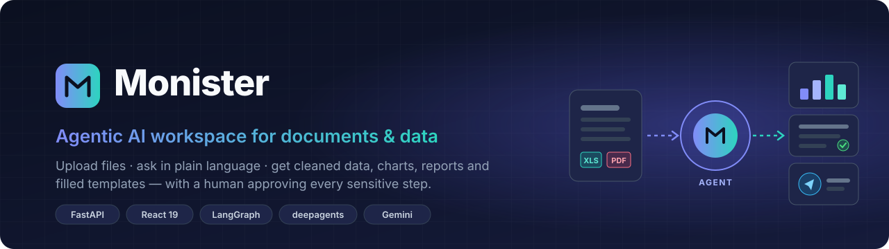
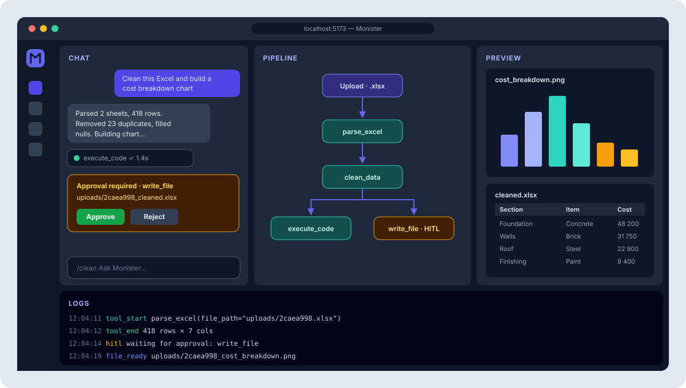
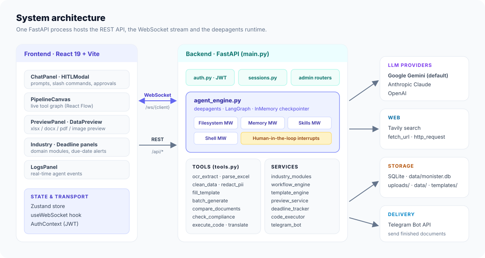
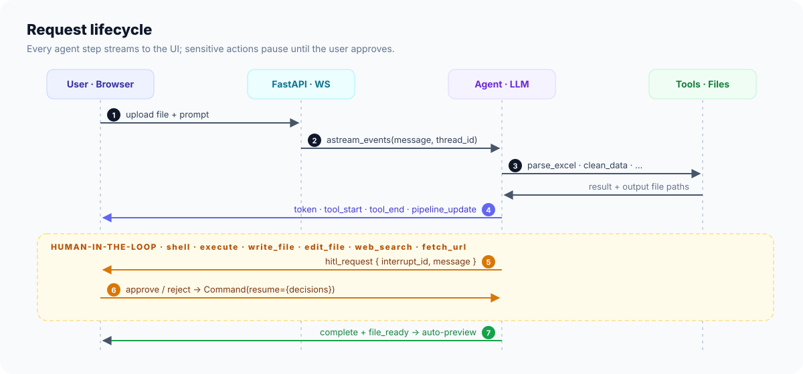
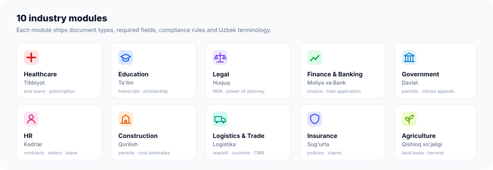

<p align="center">
  
</p>

<p align="center">
  
  
  
  
  
  
</p>

<p align="center">
  <a href="#-features">Features</a> ·
  <a href="#-architecture">Architecture</a> ·
  <a href="#-repository-layout">Repository</a> ·
  <a href="#-quick-start">Quick start</a> ·
  <a href="#-configuration">Configuration</a> ·
  <a href="#-api-reference">API</a> ·
  <a href="#-extending-monister">Extending</a>
</p>

---

**Monister** is an agentic AI workspace for everyday office paperwork. Upload an Excel sheet, a PDF or a scan, describe what you need in plain language (Uzbek or English), and the agent plans the work. It parses and cleans the data, runs analysis code, draws charts, fills document templates and sends the result to Telegram. You watch each step on a live pipeline canvas and approve anything sensitive before it runs.

The agent runtime is the [`deepagents_cli`](deepagents_cli) framework (LangChain + LangGraph). Monister adds document tools, industry modules and a web UI on top of it.

## ✨ Features

| | |
|---|---|
| 🧠 **Autonomous agent** | Plans multi-step tasks, calls tools and writes and runs Python for analysis and charts |
| ✋ **Human-in-the-loop** | `shell`, `execute`, `write_file`, `edit_file`, `web_search` and `fetch_url` pause for approve/reject in the UI |
| 📊 **Data tooling** | Excel/CSV parsing, cleaning (duplicates, nulls), OCR, document comparison, PII redaction |
| 📄 **Document generation** | Jinja2, HTML, DOCX and XLSX templates, single or batch generation from a spreadsheet |
| 🏛 **10 industry modules** | Document types, required fields and compliance rules per sector, with Uzbek terminology |
| 🔀 **Workflows** | Reusable pipelines: document generation, batch generation, OCR extraction |
| ⏰ **Deadline tracker** | Expiry and renewal dates with upcoming and overdue alerts |
| 📨 **Telegram delivery** | Sends finished files to a user by `@username` or chat ID |
| 👥 **Multi-user** | JWT auth, per-user files and chat sessions, admin panel with stats and config |

## 🖥 Interface

<p align="center">
  
</p>

The workspace has four zones:

- **Chat.** Type prompts here. `/` opens the tool picker, and approval cards appear inline.
- **Pipeline.** A live React Flow graph of every tool call the agent makes.
- **Preview.** Generated charts, spreadsheets, DOCX and PDF files open here automatically.
- **Logs.** A real-time stream of agent events.

## 📁 Repository layout

This repository holds Monister together with the framework it runs on and earlier prototypes.

| Path | What it is | Status |
|---|---|---|
| [`monister/`](monister) | **Main product.** FastAPI backend, React frontend, agent tools and industry modules | ✅ Active |
| [`deepagents_cli/`](deepagents_cli) | Agent runtime: model setup, middleware (files, memory, skills, shell), HITL, sandboxes, Textual TUI | Core dependency |
| `runv1.py`, `simple_runner.py` | Terminal runners for the deepagents agent | Experimental |
| `streamlit_app.py` | Streamlit prototype: chat with a preview column | Prototype |
| `monister/backend/`, `frontend/` | Early "DocAgent Web Platform" skeleton (FastAPI + Vite) | Superseded by `monister/` |
| `tegma/` | Archive of earlier versions and test scripts (Excel cleaning, charts, PPTX) | Archive |
| `next_task.md` | Planned agent tools (see [Roadmap](#-roadmap)) | Planning |

## 🏗 Architecture

<p align="center">
  
</p>

### Request lifecycle

<p align="center">
  
</p>

### Monister layout

```
monister/
├── backend/
│   ├── main.py              # FastAPI app: REST API, WebSocket, static mounts
│   ├── agent_engine.py      # deepagents wrapper, event streaming, HITL resume
│   ├── tools.py             # Monister agent tools (@tool)
│   ├── industry_modules.py  # 10 sector definitions (doc types, fields, rules)
│   ├── workflow_engine.py   # Multi-step workflow definitions
│   ├── template_engine.py   # Jinja2 / DOCX template rendering
│   ├── preview_service.py   # Detects generated files and triggers previews
│   ├── deadline_tracker.py  # Expiry / renewal tracking
│   ├── code_executor.py     # Sandboxed Python execution with timeouts
│   ├── telegram_bot.py      # Document delivery via Telegram Bot API
│   ├── auth.py · database.py · sessions.py
│   ├── admin.py · admin_config.py
│   └── templates/           # Hisobot/ · Ishga_kirish/ · Shartnoma/
├── frontend/
│   └── src/
│       ├── components/      # ChatPanel, PipelineCanvas, PreviewPanel, HITLModal, …
│       ├── hooks/           # useWebSocket
│       ├── contexts/        # AuthContext
│       ├── pages/           # Login, Register
│       └── stores/          # Zustand state
├── data/                    # SQLite DB + per-user files
├── uploads/                 # Uploaded and generated files
└── docs/assets/             # README images
```

## 🧰 Agent tools

| Tool | What it does |
|---|---|
| `parse_excel` | Reads an Excel/CSV file (optionally one sheet) into a structured preview |
| `clean_data` | Removes duplicates, fills nulls (mean, median, mode or zero) or drops them, and saves a cleaned copy |
| `ocr_extract` | Extracts text from PDFs and images |
| `redact_pii` | Masks personal data: emails, phone numbers (including `+998`), passport and card numbers |
| `fill_template` | Renders a DOCX, XLSX, Jinja2 or HTML template with a data dict |
| `batch_generate` | Generates one document per spreadsheet row |
| `compare_documents` | Diffs two text, DOCX or CSV/Excel files and returns a similarity score |
| `check_compliance` | Validates a document against an industry's required fields and rules |
| `translate_document` | Translates document content |
| `detect_industry` | Classifies a request into one of the industry modules |
| `execute_code_tool` | Runs Python in a restricted sandbox (analysis, charts) |
| `send_to_telegram` | Delivers a file to a Telegram user |

These come on top of the deepagents built-ins: `read_file`, `write_file`, `edit_file`, `ls`, `shell`, `web_search` (Tavily), `fetch_url` and `http_request`.

## 🏛 Industry modules

<p align="center">
  
</p>

Each module (`monister/backend/industry_modules.py`) defines its document templates with required and optional fields and compliance rules. The agent calls `detect_industry` first, so a request like *"ishga qabul buyrug'i tayyorla"* (prepare a hiring order) is routed to **HR → Hiring Order**, and the required fields are checked before the template is filled.

## 🚀 Quick start

### Prerequisites

- Python **3.11+** with the parent virtualenv at `doc.ai/.venv`, which provides `langchain`, `langgraph` and `deepagents_cli`
- Node.js **20+**
- An API key for at least one LLM provider. Gemini is the default.

### 1. Backend

```bash
# from doc.ai/
source .venv/bin/activate          # Windows: .\.venv\Scripts\activate

cd monister/backend
pip install -r requirements.txt
python main.py                     # or: uvicorn main:app --reload --port 8000
```

### 2. Frontend

```bash
cd monister/frontend
npm install
npm run dev
```

### 3. Open

| Service | URL |
|---|---|
| Web app | http://localhost:5173 |
| REST API | http://localhost:8000 |
| Swagger docs | http://localhost:8000/docs |

Register an account in the UI, upload a file and try:

> *"Clean this Excel, remove duplicates and build a cost breakdown chart by section."*

## ⚙️ Configuration

Settings are read from `doc.ai/.env`, the project root one level above `monister/`.

```env
# LLM providers: at least one is required
GOOGLE_API_KEY=
ANTHROPIC_API_KEY=
OPENAI_API_KEY=

# Web search (optional)
TAVILY_API_KEY=

# Auth: always change this outside development
JWT_SECRET=change-me
JWT_EXPIRE_MINUTES=1440

# Server
HOST=0.0.0.0
PORT=8000
DEBUG=true

# Telegram delivery (optional, can also be set in the admin panel)
TELEGRAM_BOT_TOKEN=
```

Frontend (`monister/frontend/.env`, optional):

```env
VITE_API_URL=http://localhost:8000
VITE_WS_URL=ws://localhost:8000/ws
```

The default model is set in `monister/backend/config.py` (`default_model`). It can be changed at runtime from the admin panel (`PUT /api/admin/config/agent`).

> [!WARNING]
> Never commit `.env` files. They hold live API keys. Add `.env` and `data/` to `.gitignore` before pushing.

## 📡 API reference

<details>
<summary><b>REST endpoints</b></summary>

| Method | Path | Description |
|---|---|---|
| `GET` | `/api/health` | Health check |
| `POST` | `/api/auth/register` | Create account → JWT |
| `POST` | `/api/auth/login` | Log in → JWT |
| `GET` | `/api/auth/me` | Current user |
| `POST` | `/api/upload` | Upload a file |
| `GET` | `/api/tools` | List agent tools |
| `GET` | `/api/templates` | List templates |
| `POST` | `/api/templates/recommend` | Suggest templates for a query |
| `GET` | `/api/industries` · `/api/industries/{id}` | Industry modules |
| `POST` | `/api/industries/detect` | Detect industry from text |
| `GET` `POST` | `/api/workflows` | List or create workflows |
| `GET` `POST` | `/api/deadlines` | List or create deadlines |
| `GET` | `/api/deadlines/alerts` · `/api/deadlines/upcoming` | Due-date alerts |
| `GET` `POST` | `/api/sessions` | Chat sessions |
| `POST` | `/api/sessions/{id}/title/generate` | Generate a title with the LLM |
| `GET` | `/api/admin/stats` · `/users` · `/files` | Admin dashboard |
| `GET` `PUT` | `/api/admin/config` · `/telegram` · `/industries` · `/agent` | Admin configuration |

Static files are served from `/uploads`, `/templates` and `/data`.

</details>

<details>
<summary><b>WebSocket protocol</b> — <code>ws://localhost:8000/ws/{client_id}?token=&lt;jwt&gt;</code></summary>

Server → client events:

```jsonc
{ "type": "status",          "status": "thinking" }
{ "type": "token",           "content": "…" }
{ "type": "tool_start",      "name": "parse_excel", "inputs": { … } }
{ "type": "tool_end",        "name": "parse_excel", "output": { … } }
{ "type": "pipeline_update", "nodes": [ … ] }
{ "type": "hitl_request",    "interrupt_id": "…", "message": "…" }
{ "type": "file_ready",      "filename": "…", "message": "…" }
{ "type": "complete",        "response": "…" }
{ "type": "error",           "message": "…" }
```

</details>

## 🧩 Extending Monister

**Add a template.** Drop an `.html`, `.jinja2`, `.docx` or `.xlsx` file into `monister/backend/templates/<Category>/` and use `{{ variable }}` placeholders. It shows up in the template dropdown automatically.

**Add a tool.** Define it in `monister/backend/tools.py`:

```python
@tool
def my_tool(file_path: str) -> dict:
    """One-line description — the agent reads this to decide when to call it."""
    ...
    return {"success": True, "output_path": "..."}
```

Then register it in `get_all_tools()`.

**Add an industry.** Append an `IndustryModule` with its `DocumentTemplate` entries in `monister/backend/industry_modules.py`.

## 🗺 Roadmap

- [ ] **Invoice / ID extractor**: OCR, then LLM field correction, then JSON ready for 1C or a CRM
- [ ] **Meeting protocol generator**: Whisper transcription into structured minutes
- [ ] **Contract auditor**: RAG over Lex.uz and internal standards
- [ ] **Official letter writer**: classify citizen appeals and draft formal replies
- [ ] **SQL talker**: natural-language questions answered from company databases

## 🔒 Security notes

- `code_executor.py` restricts imports and enforces timeouts, but it is not a full isolation boundary. Use a deepagents remote sandbox (Daytona, Modal or Runloop) for untrusted users.
- Change the default `JWT_SECRET` before any non-local deployment.
- SQLite and the in-memory checkpointer are for development. Use Postgres and a persistent checkpointer in production.

---

<p align="center"><sub>Built on <b>deepagents</b> · LangGraph · FastAPI · React</sub></p>
